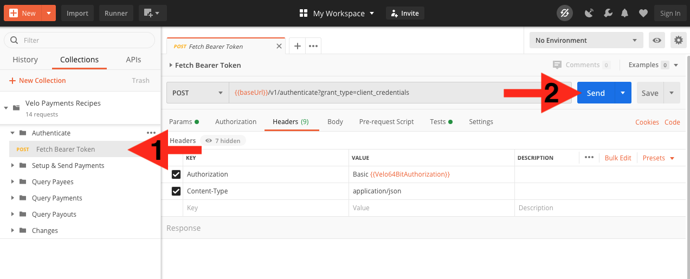

# Recipes


## Get Keys


Make sure you have your Velo Sandbox API Key and Secret

```
Note: whoever sets your sandbox payor account sets up your API credentials and shares them with you in some opsec appropriate manner
```

Create your 64Bit encoded key with them Tool to do the encoding: https://codebeautify.org/base64-encode

```
“veloapikeystring:veloapisecretstring”
```
 in the top window, be sure to put the `:` inbetween your key and secret, and that you don’t have any spaces before, after or inbetween

Copy your encoded key 64BITKEY
```
Tip: save it in the same place you’ve saved your API Key and Secret
```


## Get Postman


Install Postman local client https://www.getpostman.com


Register & create a login

Click this link to install the Velo Recipe Collection https://documenter.getpostman.com/view/343005/SVmr1ML3

- Click the ‘Run in Postman” 
 

&nbsp;

- Click Open with… “Postman for Mac”


## Setup Variables


Set global variables in postman

- Click the gear icon


## Setup Postman Variables


Set global variables in postman

- Click `Globals` Button
- Create new Variables:
    - Velo64BitAuthorization
    - VeloBearerToken
    - VeloPayorID
- Set Variable `Velo64BitAuthorization = "YOUR64BITKEY"`


## Set payorId


Fetch your bearer token

- Click ‘FetchBearerToken’
- Click ‘Send’


Success looks like this

```
Note: your token is good for 30 mins (1799 secs), and will persist for all API calls in the collection. After 30 minutes click ‘Send’ again.
```


